# 6.Các thao tác với Cobbler

# MỤC LỤC
  - [6.1.Giới thiệu giao diện web của Cobbler](#61giới-thiệu-giao-diện-web-của-cobbler)
  - [6.2.Import các hệ điều hành vào Cobbler](#62import-các-hệ-điều-hành-vào-cobbler)
  - [6.3.Tạo file kickstart](#63tạo-file-kickstart)
  - [6.4.Tạo profiles](#64tạo-profiles)


## 6.1.Giới thiệu giao diện web của Cobbler
\- Giao diện tổng quan  
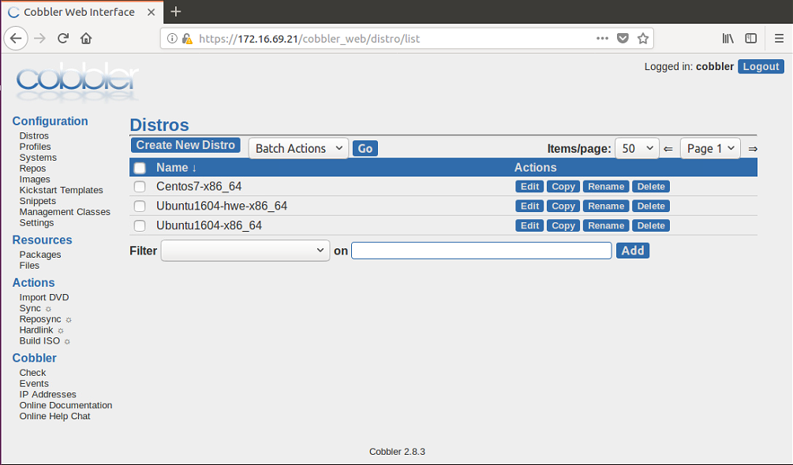

\- Giao diện **Distros**  
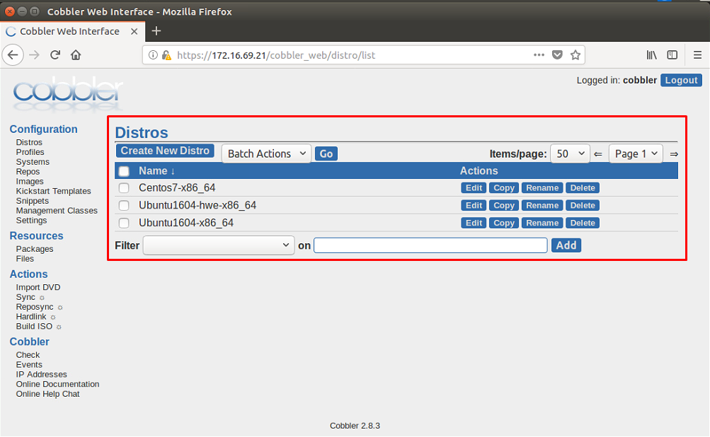

Distros nằm trong thư mục `/var/www/cobbler/images/` .  

\- Giao diện **Profiles**  
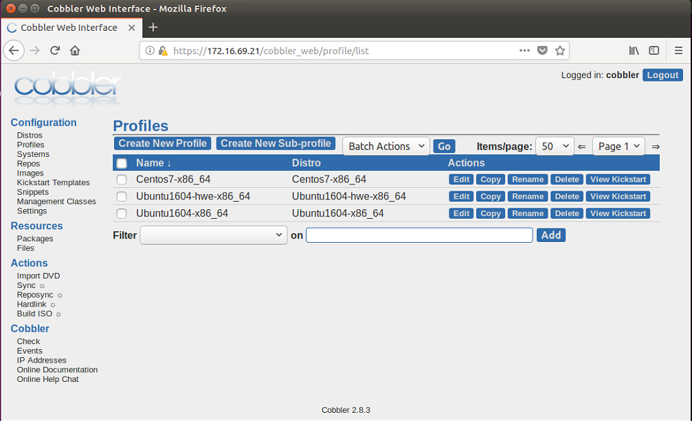

\- Giao diện **Kickstart Templates**  
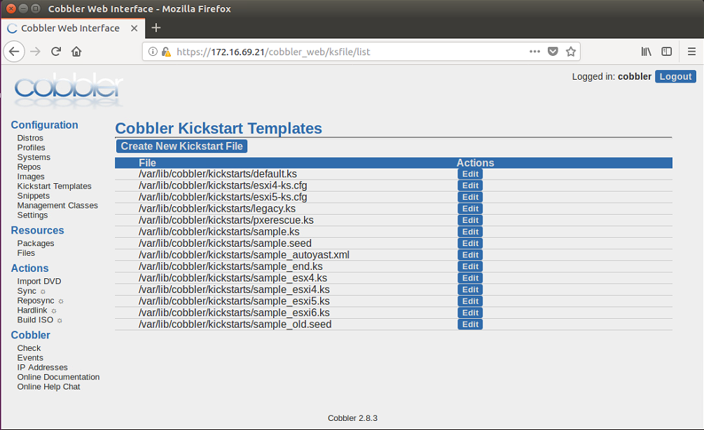

Kickstart nằm trong thư mục `/var/lib/cobbler/kickstarts/` .  
\- Giao diện **Snippets**  
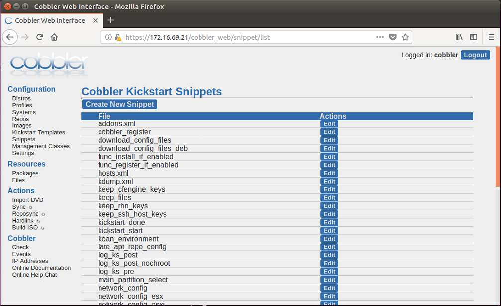

Snippets nằm trong thư mục `/var/lib/cobbler/snippets/` .  
\- Các giao diện về Systems, Repos, … , mình chưa tìm hiểu!  

## 6.2.Import các hệ điều hành vào Cobbler  
\- Download file iso của các hệ điều hành về, ở đây tôi download **Ubuntu Server 16.04** và **Centos 7**. Thực hiện lệnh:  
```
wget http://releases.ubuntu.com/xenial/ubuntu-16.04.5-server-amd64.iso
wget http://centos-hn.viettelidc.com.vn/7/isos/x86_64/CentOS-7-x86_64-DVD-1804.iso
```

Sau khi download xong ta có 2 file `ubuntu-16.04.5-server-amd64.iso` và `CentOS-7-x86_64-DVD-1804.iso` .  
\- Thực hiện mount iso và import vào Cobbler. Thực hiện lệnh sau:  
Ubuntu:  
```
mkdir /mnt/ubuntu1604
mount -o loop ubuntu-16.04.5-server-amd64.iso /mnt/ubuntu1604
cobbler import --arch=x86_64 --path=/mnt/ubuntu1604 --name=Ubuntu1604
```

Centos:  
```
mkdir /mnt/centos7
mount -o loop CentOS-7-x86_64-DVD-1804.iso /mnt/centos7
cobbler import --arch=x86_64 --path=/mnt/centos7 --name=Centos7
```

\- Trong quá trình import, nếu có lỗi xảy ra thì thực hiện lệnh sau:  
```
cobbler signature update
```

\- Sau khi thực hiện import xong, ta thực hiện umount:  
```
umount /mnt/ubuntu1604
umount /mnt/centos7
```

\- Kiểm tra trên giao diện của Cobbler:  
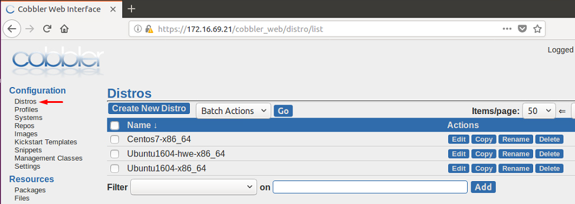

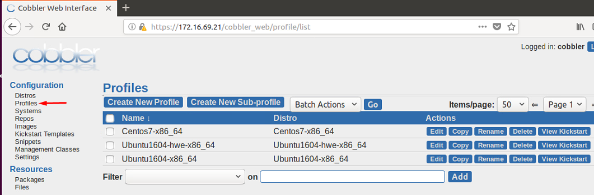

Hoặc thực hiện lệnh để kiểm tra:  
```
cobbler distro report --name=Ubuntu1604-x86_64
cobbler profile report --name=Ubuntu1604-x86_64
```

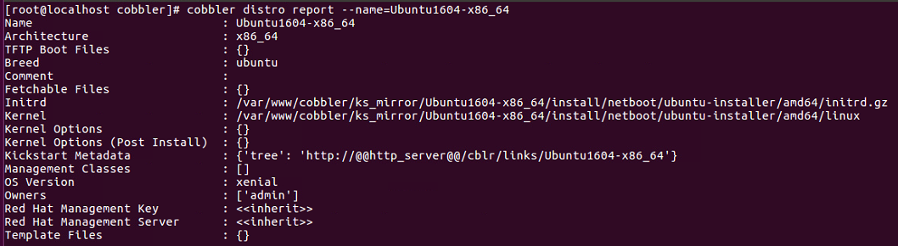

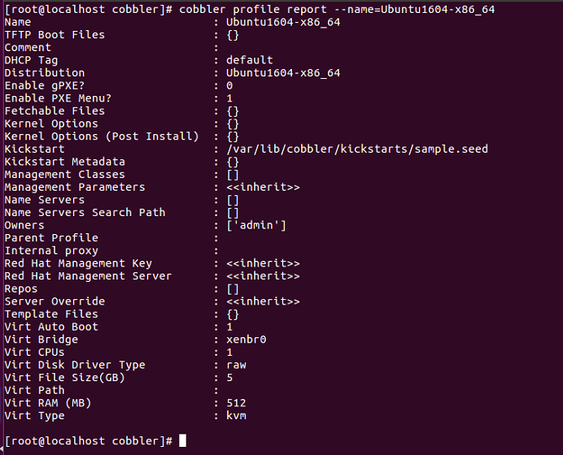

\- Chú ý:  
- Khi import file iso chứa OS vào Cobbler, cobbler sẽ tạo ra các distro, repo và profile tương ứng. Profile được tạo là sự kết hợp giữa distro và file kickstart template được cho sẵn bởi Cobbler (đối với Ubuntu sẽ dùng file kickstart `.seed` , Centos sẽ dùng file kickstart `.ks`).  
Repo được chứa `/var/www/cobbler/ks_mirror` .  
- Khi thực hiện lệnh import:  
```
cobbler import --arch=x86_64 --path=/mnt/ubuntu1604 --name=Ubuntu1604
```

thì tên của distro tạo ra là sự kết hợp của tùy chọn `--name` và `--arch`. Mẫu tên sẽ là `<name>-<arch>`  .  
Trong trường hợp trên tên distro sẽ là `Ubuntu1604- x86_64`.  

## 6.3.Tạo file kickstart
\- Cách 1: Ta có thể tạo file trong thư mục `/var/lib/cobbler/kickstarts`.  
\- Cách 2: Ta sử dụng giao diện web.  
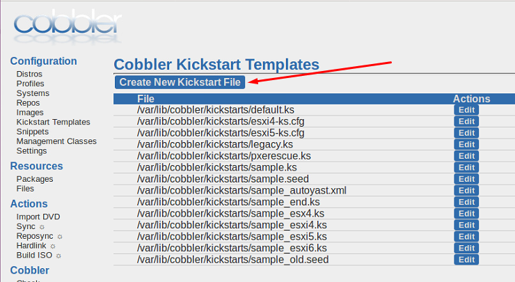

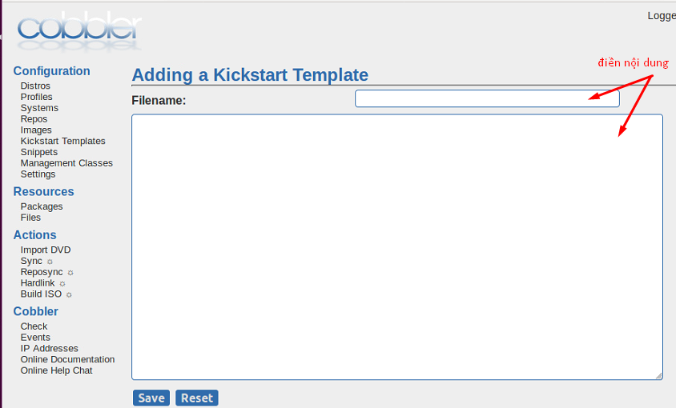

## 6.4.Tạo profiles
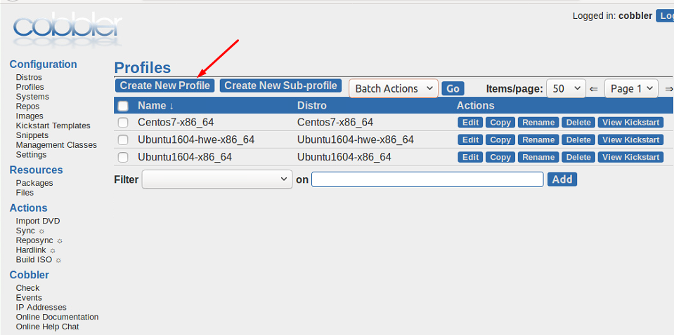

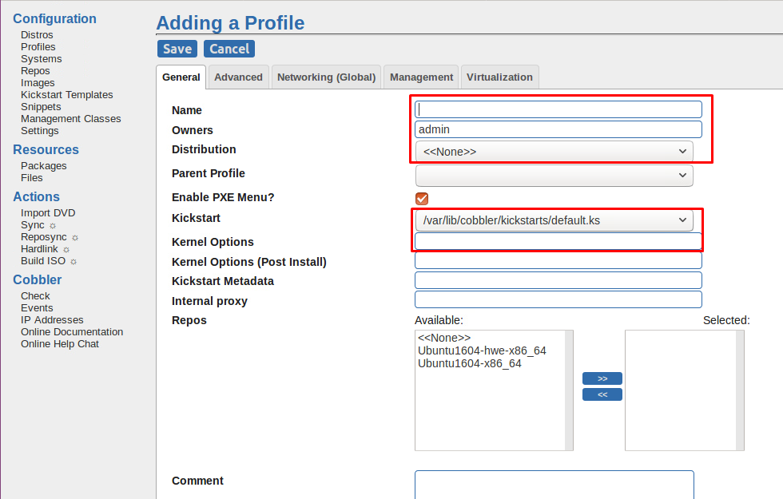

\- Trong đó các trường:  
- Name: tên profiles
- Owners: mặc định là admin, mình chưa tìm hiểu
- Distribution: Distro của hệ điều hành
- Enable PXE Menu: mặc định kích hoạt, mình chưa tìm hiểu
- Kickstart: file kickstart đi kèm
- Kernel  Options: cấu hình được ghi vào file `/var/lib/tftpboot/pxelinux.cfg/default` .  

Các trường khác, mình chưa tìm hiểu.  


