# 7.Các thao tác khác với Cobbler

# MỤC LỤC
  - [7.1.Giới thiệu giao diện web của Cobbler](#71giới-thiệu-giao-diện-web-của-cobbler)
  - [7.2.Distro](#72distro)
  - [7.3.Profile](#73profile)
  - [7.4.System](#74system)
  - [7.5.Repo](#75repo)
  - [7.6.Check log trên web](#76check-log-trên-web)
  - [7.7.User](#77user)
  - [7.8.Một số chú ý](#78một-số-chú-ý)


## 7.1.Giới thiệu giao diện web của Cobbler
\- Giao diện tổng quan  
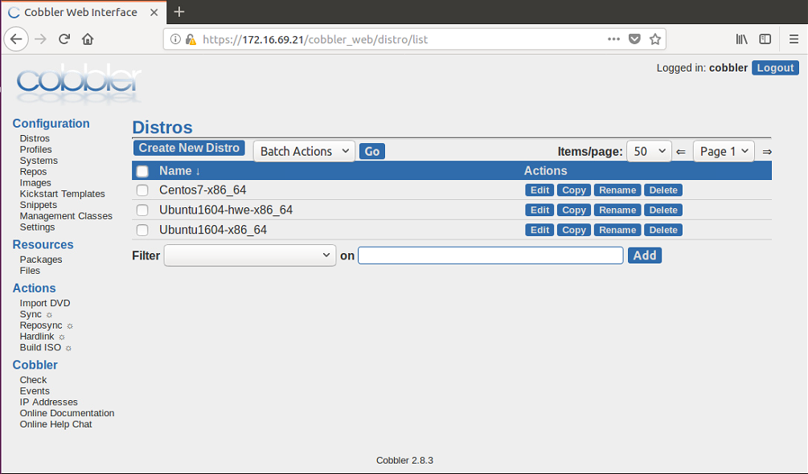

\- Giao diện **Distros**  
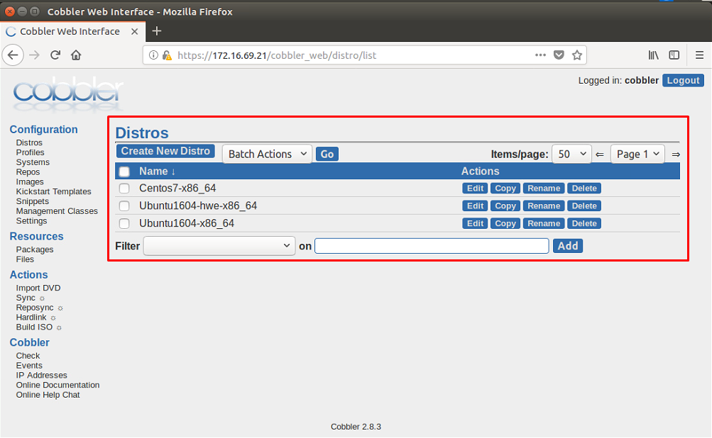

Distros nằm trong thư mục `/var/www/cobbler/images/` .  

\- Giao diện **Profiles**  
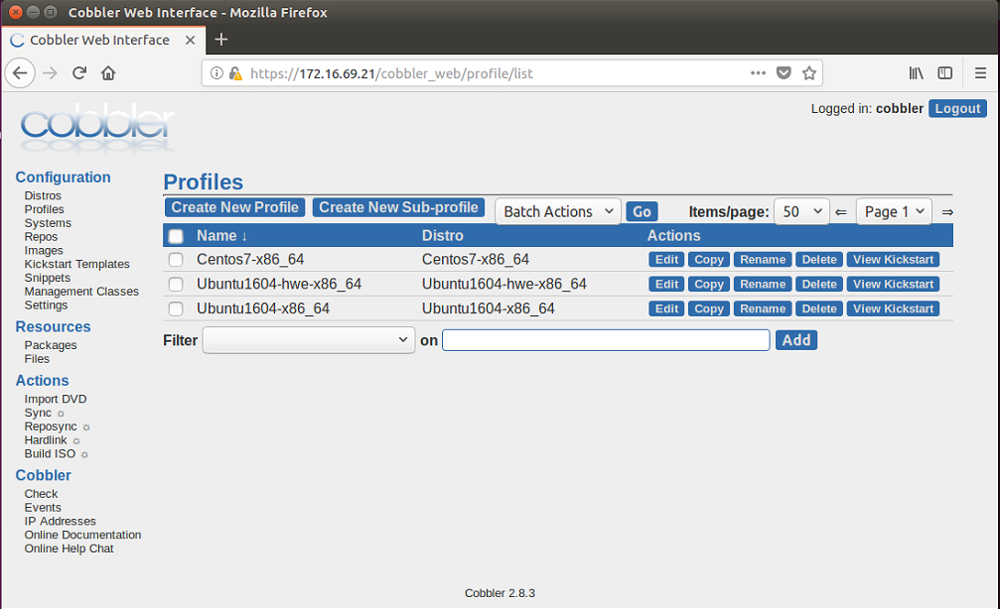

\- Giao diện **System**  
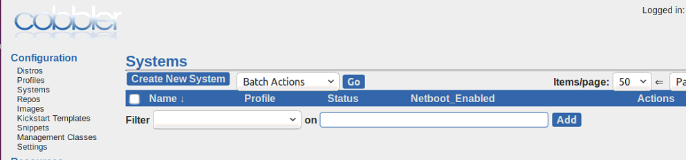

\- Giao diện **Repo**  
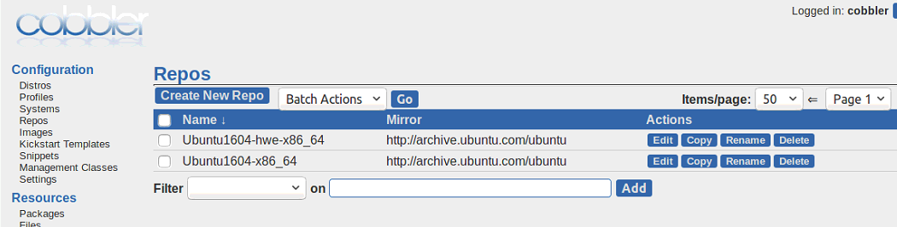

Repos nằm trong thư mục `/var/www/cobbler/repo_mirror/` .  

\- Giao diện **Images**  
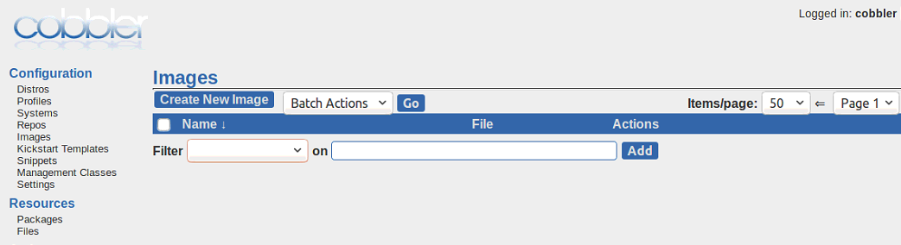

\- Giao diện **Kickstart Templates**  
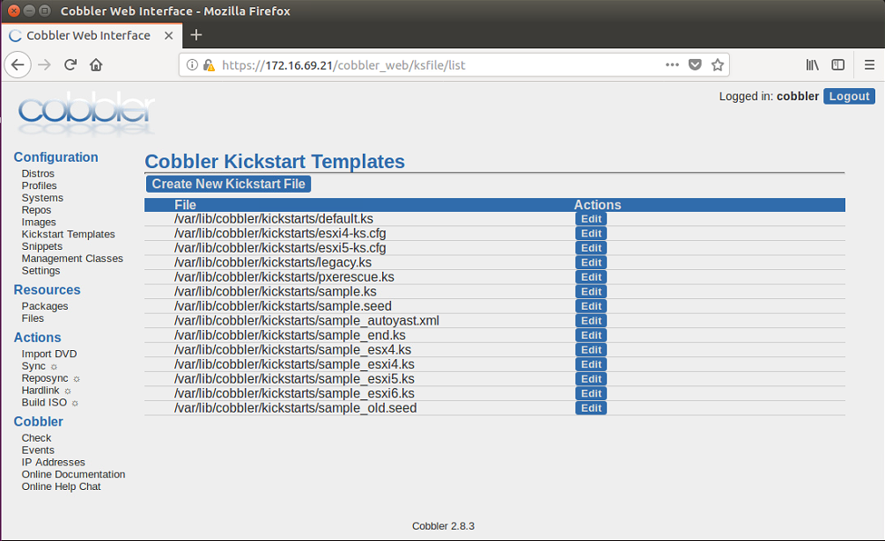

Kickstart nằm trong thư mục `/var/lib/cobbler/kickstarts/` .  
\- Giao diện **Snippets**  
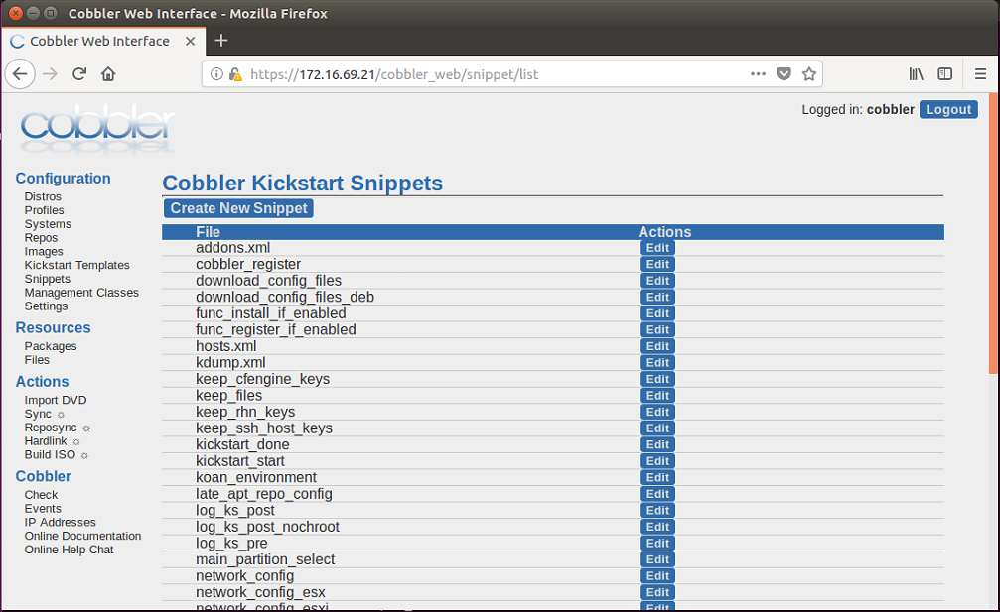

Snippets nằm trong thư mục `/var/lib/cobbler/snippets/` .  

## 7.2.Distro
\- Các câu lệnh sử dụng quản lý distro:  
- cobbler distro add : thêm distro
- cobbler distro copy : copy từ một distro ra một distro mới.
- cobbler distro edit : sửa thông tin distro
- cobbler distro find : tìm kiếm thông tin về distro
- cobbler distro list : liệt kê danh sách các distro
- cobbler distro remove : xóa distro nào đó khỏi hệ thống cobbler
- cobbler distro rename : đổi tên cobbler
- cobbler distro report : Hiển thị các thông tin chi tiết về distro

\- Ví dụ 1: Thêm distro:  
```
cobbler distro add --name=<string> --kernel=path --initrd=path [options]
```

Trong đó `--name` là tên của distro (Centos 7, Ubuntu 16.04, ...), `--kernel` là đường dẫn chỉ tới vị trí kernel, `--initrd` là đường dẫn chỉ tới vị trí của initrd.  
Một số tùy chọn tham khảo thêm tại: http://cobbler.github.io/manuals/2.8.0/3/1/1_-_Distros.html

\- VD2: Liệt kê các distro đang có trong hệ thống:  
```
cobbler distro list
```

\- VD3: Xem thông tin chi tiết distro:  
```
cobbler distro report Centos7-x86_64
```

\- Để thao tác với distro trên giao diện web, truy cập vào tab Distro sẽ hiển thì giao diện như sau:  
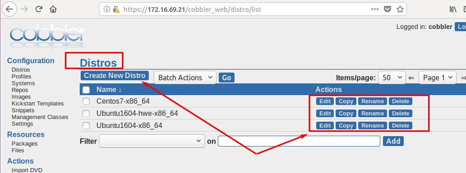

\- Chú ý:  
Nếu muôn xóa distros, ta phải xóa các profiles liên kết với distros trước!  

## 7.3.Profile
\- Các câu lệnh quản lý profile như sau:  
- cobbler profile --help
- cobbler profile add
- cobbler profile copy
- cobbler profile dumpvars
- cobbler profile edit
- cobbler profile find
- cobbler profile getks
- cobbler profile list
- cobbler profile remove
- cobbler profile rename
- cobbler profile report

\- VD1: Liệt kê các profiles đang có trong hệ thống:  
```
cobbler profile list
```

\- VD2: Hiển thị nội dung file kickstart của profile:  
```
cobbler profile getks --name CentOS7-x86_64
```

## 7.4.System
\- Phần này mình chưa tìm hiểu, các bạn tham khảo:  
http://cobbler.github.io/manuals/2.8.0/3/1/3_-_Systems.html

## 7.5.Repo
\- Repository mirroring cho phép Cobbler sao chép lại không chỉ các gói cài đặt của distro từ @tree (Các gói phần mềm cài đặt ban đầu khi cài đặt OS, xuất hiện khi sử dụng cobbler import) mà còn các gói phần mềm tùy chọn hoặc từ các bên thứ 3, và thậm chí là các bản cập nhật của các phần mềm của OS.  
\- Thư mục chứa repo: `/var/www/cobbler/repo_mirror`  .  
\- Quản lý repos bằng dòng lệnh tham khảo tại đây:  http://cobbler.github.io/manuals/2.8.0/3/1/5_-_Repos.html
\- Thao tác thông qua giao diện như sau:  
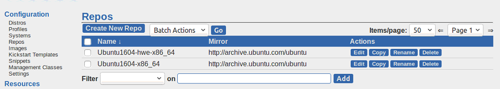

\- Tạo repo  
Bạn có thể tạo mirros repo là cả repo. Dưới đây là repo ubuntu  
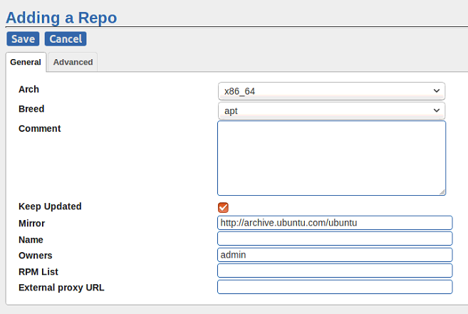

Hoặc bạn có tạo mirror repo là 1 phần nhỏ của repo. Dưới đây là repo Centos: `http://mirror.centos.org/centos/7.5.1804/cloud/x86_64/openstack-queens/`  

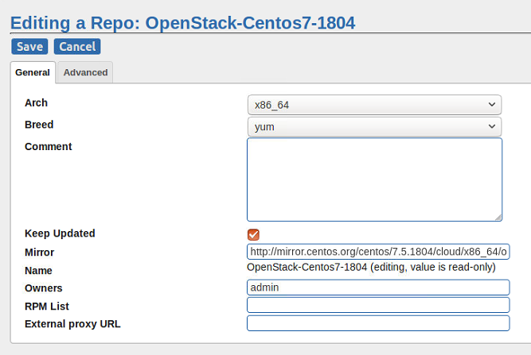

Sau khi hoàn thiện thông tin về repos, để cập nhật các gói phần mềm từ các repo của nhà cung cấp hoặc từ các bên thứ ba, thực hiện động bộ repo với hệ thống. **Click vào reposync** (khuyến cáo không nên dùng nếu cobbler server không đủ dung lượng lưu trữ tất cả các gói phần mềm từ repo chính mà định mirror).  
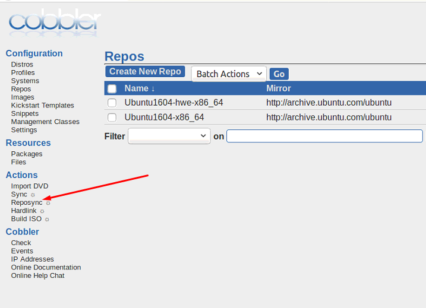

Lưu ý: Khi cick vào **Reposync** , hệ thống sẽ chạy tiến trình ngầm đồng bộ ngay lập tức.  

\- Chỉ định client sử dụng repo. Dưới đây là ví dụ mình cấu hình Client Centos 7 sử dụng local mirror repo `OpenStack-Centos7-1804` do mình tạo ra trên Cobbler Server.  
- Ta truy cập vào file `/var/www/cobbler/repo_mirror/OpenStack-Centos7-1804/config.repo` (mỗi khi tạo repo mirros, sẽ có file `config.repo` được tạo ra) , nội dung file như sau:  
```
[OpenStack-Centos7-1804]
name=OpenStack-Centos7-1804
baseurl=http://${http_server}/cobbler/repo_mirror/OpenStack-Centos7-1804
enabled=1
priority=99
gpgcheck=0
```

- Trên Client, tạo file `/etc/yum.repos.d/OpenStack-Centos7-1804.repo` với dung như sau:  
```
[OpenStack-Centos7-1804]
name=OpenStack-Centos7-1804
baseurl=http://172.16.69.21/cobbler/repo_mirror/OpenStack-Centos7-1804
enabled=1
priority=99
gpgcheck=0
```

**Chú ý**: Thay thế `${http_server}` thành địa chỉ IP của Cobbler, ở đây là `172.16.69.21` .  

## 7.6.Check log trên web
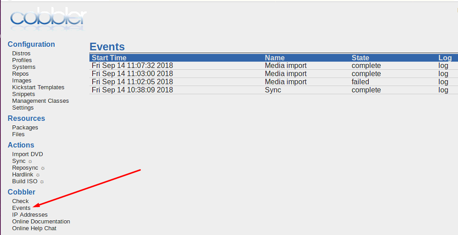

## 7.7.User
\- Mặc định, ban đầu Cobbler có người dùng quản trị là `cobbler` và mật khẩu là `cobbler`. Việc này không đảm bảo tính bảo mật của hệ thống. Nên tạo một người dùng mới cho hệ thống của bạn và dùng mật khẩu mà chỉ người quản trị mới biết được. Đồng thời xóa người dùng `cobbler` mặc định đi.  
\- Thông tin về các tài khoản của người dùng được lưu trong file `/etc/cobbler/users.digest` .  
Mặc định ban đầu nội dung file như sau:  
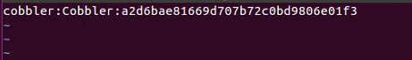
 
\- Thêm tài khoản mới cho hệ thống, ta sử dụng lệnh:  
```
htdigest /etc/cobbler/users.digest "Cobbler" <user_name>
```

lưu ý: user_name chưa tồn tại trên hệ thống.  
Sau đó nhập password vào thiết lập mật khấu cho tài khoản mới thêm. Sau khi thêm tài khoản mới, kiểm tra lại tài khoản mới đã có chưa trong file `/etc/cobbler/users.digest` .  
Khởi động lại cobbler:  
```
systemctl restart cobblerd
cobbler sync
```

\- Xóa tài khoản, ta comment hoặc xóa tài khoản trong file `/etc/cobbler/users.digest` .  
Khởi động lại cobbler:  
```
systemctl restart cobblerd
cobbler sync
```

\- Đổi mật khẩu tài khoản đã tồn tại trên hệ thống, ta sử dụng lệnh:  
```
htdigest /etc/cobbler/users.digest "Cobbler" <user_name>
```

lưu ý: user_name là tài khoản cần đổi mật khẩu trên hệ thống.  
Sau đó nhập password vào thiết lập mật khấu mới cho tài khoản này.  
Khởi động lại cobbler:  
```
systemctl restart cobblerd
cobbler sync
```

## 7.8.Một số chú ý
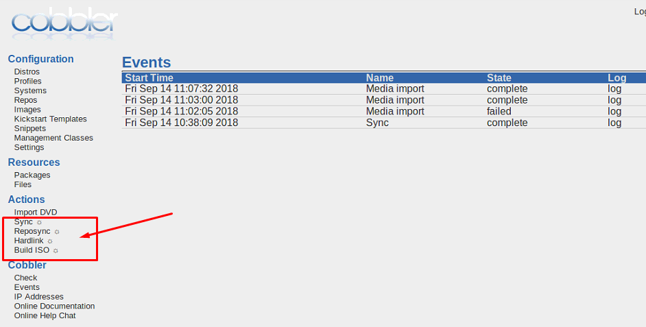

Không nên click vào khi không có nhu cầu, vì khi click Cobbler sẽ tạo tiến trình ngầm!  
VD như click vào **Reposync** , Cobbler tạo tiến trình đồng bộ mirror.  

