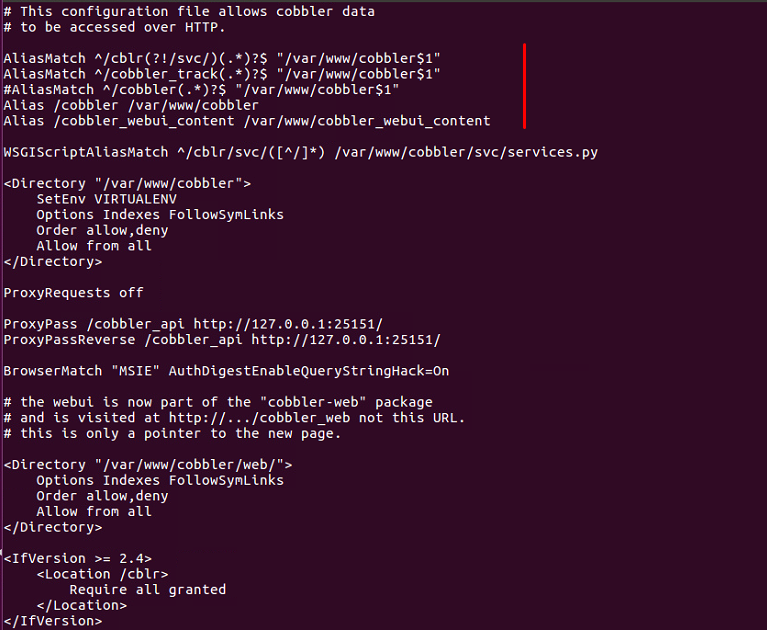

# 5.Các thư mục cấu hình, lưu trữ của Cobbler

# MỤC LỤC
  - [5.1.Cấu hình](#51cấu-hình)
  - [5.2.Repo dữ liệu](#52repo-dữ-liệu)
  - [5.3.Log](#53log)
  - [5.4.Cobbler data](#54cobbler-data)
  - [5.5.Một số thư mục cần chú ý khác](#55một-số-thư-mục-cần-chú-ý-khác)
    - [5.5.1.Các thư mục được apache web server mapping](#551các-thư-mục-được-apache-web-server-mapping)
    - [5.5.2.Thư mục boot tftp](#552thư-mục-boot-tftp)


<a name="5.1"><a>

## 5.1.Cấu hình 
\- Cấu hình cobbler, thư mục `/etc/cobbler`. Trong đó:  
- File cấu hình chính: `/etc/cobbler/settings`
- Ngoài ra còn có file templaces mặc định để cấu hình dhcp, dnsmasq
- File định nghĩa username và password: `/etc/cobbler/users.digest`
- File thiết lập các modules: `/etc/cobbler/modules.conf`
- File thiết lập quyền của người dùng: `/etc/cobbler/users.conf`

<a name="5.2"><a>

## 5.2.Repo dữ liệu
\- Repo dữ liệu cobbler, thư mục `/var/www/cobbler` . Các distros được imported, repos mirrored, các repo được sinh ra, cac files kickstart được sinh ra đều được đặt trong này. Trong đó:  
- Thư mục `images`: Kernel và initrd của tất cả các distro được imported.
- Thư mục `ks_mirror` : Mirrors của tất cả các distros được imported.
- Thư mục `repo_mirror` : Mirrors của tất cả các repo được định nghĩa.

<a name="5.3"><a>

## 5.3.Log
\- Log của cobbler, thư mục `/var/log/cobbler`. File main log là `/var/log/cobbler/cobbler.log` .  

<a name="5.4"><a>

## 5.4.Cobbler data
\- Thư mục `/var/lib/cobbler`. Tất cả cấu hình của Cobbler về profiles, systems, distros đều được  đặt trong thư mục này. Backup nó, dữ liệu cobbler của bạn sẽ an toàn (ngoại trừ distros và repos trong thư mục `/var/www/cobbler` )  
\- Trong đó:  
- `configs/` : Thư mục chứa thông tin về distros, repos, systems và profiles được lưu
- `backup/` : Thư mục về các files ở trên được sao chép tự động.
- `snippets/`  - Thư mục nơi bạn có thể đặt snippets để import vào kickstarts của bạn.
- `triggers/` : Thư mục bạn có thể đặt scripts để thực thi triggers trên một số thao tác nhất định.
- `kickstarts/` : Thư mục chứa các kickstarts templates.

<a name="5.5"><a>

## 5.5.Một số thư mục cần chú ý khác

<a name="5.5.1"><a>

### 5.5.1.Các thư mục được apache web server mapping
\- Show nội dung file `/etc/httpd/conf.d/cobbler.conf` :  



\- Với 2 dòng:  
```
Alias /cobbler /var/www/cobbler
Alias /cobbler_webui_content /var/www/cobbler_webui_content
```

Ý nghĩa 2 dòng này là map link `/cobbler` trỏ đến thư mục `/var/www/cobbler` , `/cobbler_webui_content` trỏ đến thư mục `/var/www/cobbler_webui_content` .  
Từ đó, từ client ta có thể truy cập vào repo trên Cobbler server thông qua đường dẫn:  
```
http://<IP_address>/cobbler/ks_mirror/
```

\- Dòng:  
```
AliasMatch ^/cblr(?!/svc/)(.*)?$ "/var/www/cobbler$1"
```

Đã mapp  
```
http://<IP_address>/cobbler/ks_mirror/
```

thành  
```
http://<IP_address>/cblr/links/
```

\- Kết luận:  
Từ đó, từ client ta nên truy cập vào repo trên Cobbler server thông qua đường dẫn:  
```
http://<IP_address>/cblr/links/
```

<a name="5.5.2"><a>

### 5.5.2.Thư mục boot   tftp   
\- Thư mục boot của tftp : `/var/lib/tftpboot/` .
\- Trong đó file `/var/lib/tftpboot/pxelinux.cfg/default` là main file là giao diện cho các Client khi chọn boot.


