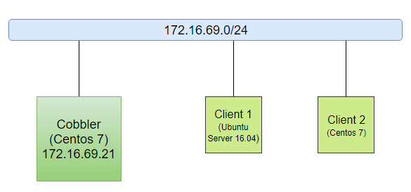

# 8.LAB

# MỤC LỤC
  - [8.1.Mô hình](#81mô-hình)
  - [8.2.Cài đặt và cấu hình Cobbler](#82cài-đặt-và-cấu-hình-cobbler)
  - [8.3.Import các hệ điều hành](#83import-các-hệ-điều-hành)
  - [8.4.Tạo file kickstart](#84tạo-file-kickstart)
    - [a.Ubuntu Server 16.04](#aubuntu-server-1604)
    - [b.Centos 7](#bcentos-7)
  - [8.5.Client 1 và Client 2](#85client-1-và-client-2)


## 8.1.Mô hình


\- Bài lab thực hiện trên server cài đặt ảo hóa qemu-kvm với Cobbler, Client 1 và Client 2 là các máy ảo.  
\- Chú ý tắt DHCP server của mạng `172.16.69.0/24`.  

## 8.2.Cài đặt và cấu hình Cobbler
\- Cài đặt và cấu hình sử dụng scripts, file [cobbler-install.sh](../scripts/cobbler-install.sh). Thực hiện các lệnh sau với quyền `root` :  
\- Set quyền cho file bash shell:  
```
chmod 755 cobbler-install.sh
```

\- Thay đổi giá trị của biến trong file bash shell sao cho phù hợp mô hình.  
\- Thực hiện lệnh sau để hoàn tất:  
```
bash cobbler-install.sh
```

\- Truy cập vào giao diện Web  
Sau khi hoàn thành các bước trên, truy cập vào giao diện web của Cobbler như sau (lưu ý: sử dụng `https`):  
```
https://172.16.69.21/cobbler_web/
```


Đăng nhập với tài khoản mặc định có username là `cobbler`, mật khẩu là `cobbler` .

## 8.3.Import các hệ điều hành
\- Download file iso của các hệ điều hành về, ở đây tôi download **Ubuntu Server 16.04** và **Centos 7**. Thực hiện lệnh:  
```
wget http://releases.ubuntu.com/xenial/ubuntu-16.04.5-server-amd64.iso
wget http://centos-hn.viettelidc.com.vn/7/isos/x86_64/CentOS-7-x86_64-DVD-1804.iso
```

Sau khi download xong ta có 2 file `ubuntu-16.04.5-server-amd64.iso` và `CentOS-7-x86_64-DVD-1804.iso` .  
\- Thực hiện mount iso và import vào Cobbler. Thực hiện lệnh sau:  
Ubuntu:  
```
mkdir /mnt/ubuntu1604
mount -o loop ubuntu-16.04.5-server-amd64.iso /mnt/ubuntu1604
cobbler import --arch=x86_64 --path=/mnt/ubuntu1604 --name=Ubuntu1604
```

Centos:  
```
mkdir /mnt/centos7
mount -o loop CentOS-7-x86_64-DVD-1804.iso /mnt/centos7
cobbler import --arch=x86_64 --path=/mnt/centos7 --name=Centos7
```

\- Trong quá trình import, nếu có lỗi xảy ra thì thực hiện lệnh sau:  
```
cobbler signature update
```

\- Sau khi thực hiện import xong, ta thực hiện umount:  
```
umount /mnt/ubuntu1604
umount /mnt/centos7
```

## 8.4.Tạo file kickstart
### a.Ubuntu Server 16.04
\- Tạo file `ubuntu16.04.seed` trong thư mục `/var/lib/cobbler/kickstarts` với nội dung như file [ubuntu16.04.seed](../Kickstart/ubuntu16.04.seed) .  
\- Tạo profile tên `Ubuntu1604-auto`, với cấu hình như sau:  


Trường "Kernel Options" có nội dung: `interface=eth0 biosdevname=0 net.ifnames=0` .  

### b.Centos 7
\- Tạo file `centos7-1804.ks` trong thư mục `/var/lib/cobbler/kickstarts` với nội dung như file:  
- [centos7-1804.ks](../Kickstart/centos7-1804.ks) nếu cài đặt phân vùng ổ cứng theo standard.
- [centos7-1804-lvm.ks](../Kickstart/centos7-1804-lvm.ks) nếu cài đặt phân vùng ổ cứng theo LVM.

Chú ý: Khi viết file kickstart cài centos theo LVM. Đoạn cấu hình LVM:  
```
#System bootloader configuration
bootloader --location=mbr
#Partition clearing information
clearpart --all
#Basic disk partition
part /boot --fstype xfs --size 1024 --ondisk=vda
part pv.01 --size=5 --grow --asprimary --ondisk=vda
volgroup vg1 pv.01
logvol swap --fstype="swap" --name=centos-swap --vgname=vg1 --size=2048
logvol / --fstype=xfs --name=centos-root --vgname=vg1 --size=5 --grow
```

`pv.01` là chuẩn nhất. Bạn có thể thay đổi thành `pv.<string>`.  
Nhưng nếu bạn ko có dấu `.` , chẳng hạn `pv01` thì hệ thống boot OS trên Client sẽ báo lỗi không tạo được `pv01`.  


\- Tạo profile tên `Centos7-auto`, với cấu hình như sau:  


\- Trường "Kernel Options" không cần chỉ định `interface=eth0` , do Centos7 tự động chọn interface để boot là "**interface chọn lúc chọn boot từ PXE**".  

## 8.5.Client 1 và Client 2
\- Yêu cầu NIC hỗ trợ boot bằng PXE.  
\- Chọn boot từ PXE.  


