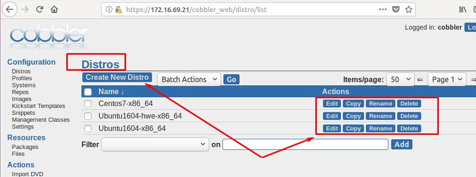
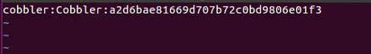

# 7.Lệnh sử dụng với Cobbler

# MỤC LỤC
  - [7.1.Distro](#71distro)
  - [7.2.Profile](#72profile)
  - [7.3.User](#73user)


## 7.1.Distro
\- Các câu lệnh sử dụng quản lý distro:  
- cobbler distro add : thêm distro
- cobbler distro copy : copy từ một distro ra một distro mới.
- cobbler distro edit : sửa thông tin distro
- cobbler distro find : tìm kiếm thông tin về distro
- cobbler distro list : liệt kê danh sách các distro
- cobbler distro remove : xóa distro nào đó khỏi hệ thống cobbler
- cobbler distro rename : đổi tên cobbler
- cobbler distro report : Hiển thị các thông tin chi tiết về distro

\- Ví dụ 1: Thêm distro:  
```
cobbler distro add --name=<string> --kernel=path --initrd=path [options]
```

Trong đó `--name` là tên của distro (Centos 7, Ubuntu 16.04, ...), `--kernel` là đường dẫn chỉ tới vị trí kernel, `--initrd` là đường dẫn chỉ tới vị trí của initrd.  
Một số tùy chọn tham khảo thêm tại: http://cobbler.github.io/manuals/2.8.0/3/1/1_-_Distros.html

\- VD2: Liệt kê các distro đang có trong hệ thống:  
```
cobbler distro list
```

\- VD3: Xem thông tin chi tiết distro:  
```
cobbler distro report Centos7-x86_64
```

\- Để thao tác với distro trên giao diện web, truy cập vào tab Distro sẽ hiển thì giao diện như sau:  


## 7.2.Profile
\- Các câu lệnh quản lý profile như sau:  
- cobbler profile --help
- cobbler profile add
- cobbler profile copy
- cobbler profile dumpvars
- cobbler profile edit
- cobbler profile find
- cobbler profile getks
- cobbler profile list
- cobbler profile remove
- cobbler profile rename
- cobbler profile report

\- VD1: Liệt kê các profiles đang có trong hệ thống:  
```
cobbler profile list
```

\- VD2: Hiển thị nội dung file kickstart của profile:  
```
cobbler profile getks --name CentOS7-x86_64
```

## 7.3.User
\- Mặc định, ban đầu Cobbler có người dùng quản trị là `cobbler` và mật khẩu là `cobbler`. Việc này không đảm bảo tính bảo mật của hệ thống. Nên tạo một người dùng mới cho hệ thống của bạn và dùng mật khẩu mà chỉ người quản trị mới biết được. Đồng thời xóa người dùng `cobbler` mặc định đi.  
\- Thông tin về các tài khoản của người dùng được lưu trong file `/etc/cobbler/users.digest` .  
Mặc định ban đầu nội dung file như sau:  

 
\- Thêm tài khoản mới cho hệ thống, ta sử dụng lệnh:  
```
htdigest /etc/cobbler/users.digest "Cobbler" <user_name>
```

lưu ý: user_name chưa tồn tại trên hệ thống.  
Sau đó nhập password vào thiết lập mật khấu cho tài khoản mới thêm. Sau khi thêm tài khoản mới, kiểm tra lại tài khoản mới đã có chưa trong file `/etc/cobbler/users.digest` .  
Khởi động lại cobbler:  
```
systemctl restart cobblerd
cobbler sync
```

\- Xóa tài khoản, ta comment hoặc xóa tài khoản trong file `/etc/cobbler/users.digest` .  
Khởi động lại cobbler:  
```
systemctl restart cobblerd
cobbler sync
```

\- Đổi mật khẩu tài khoản đã tồn tại trên hệ thống, ta sử dụng lệnh:  
```
htdigest /etc/cobbler/users.digest "Cobbler" <user_name>
```

lưu ý: user_name là tài khoản cần đổi mật khẩu trên hệ thống.  
Sau đó nhập password vào thiết lập mật khấu mới cho tài khoản này.  
Khởi động lại cobbler:  
```
systemctl restart cobblerd
cobbler sync
```


