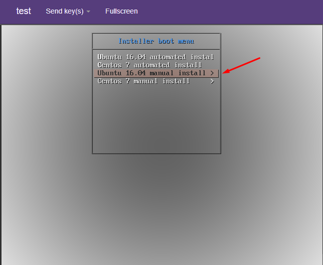

# 2.Kickstart với PXE

# MỤC LỤC
  - [2.1.Giới thiệu](#21giới-thiệu)
  - [2.2.Thực hiện cài đặt Kickstart như thế nào?](#22thực-hiện-cài-đặt-kickstart-như-thế-nào?)
  - [2.3.PXE workflow khi sử dụng kickstart](#23pxe-workflow-khi-sử-dụng-kickstart)
  - [2.4.netboot image](#24netboot-image)
  - [2.5.LAB PXE sử dụng KICKSTART](#25lab-pxe-sử-dụng-kickstart)
    - [2.5.1.Mô hình](#251mô-hình)
    - [2.5.2.Cài đặt và cấu hình](#252cài-đặt-và-cấu-hình)
      - [2.5.2.1.Trên PXE Server](#2521trên-pxe-server)
        - [a.Cài đặt và cấu hình DHCP Server](#acài-đặt-và-cấu-hình-dhcp-server)
        - [b.Cài đặt và cấu hình TFTP Server](#bcài-đặt-và-cấu-hình-tftp-server)
        - [c.Cấu hình prelinux](#ccấu-hình-prelinux)
        - [d.Cấu hình netboot image](#dcấu-hình-netboot-image)
        - [e.Cấu hình để PXE client cài Ubuntu Server 16.04 và Centos 7 từ repo local](#ecấu-hình-để-pxe-client-cài-ubuntu-server-1604-và-centos-7-từ-repo-local)
        - [f.File kickstart](#ffile-kickstart)
      - [2.5.2.2.Trên Client 1](#2522trên-client-1)
      - [2.5.2.3.Trên Client 2](#2523trên-client-2)
  - [2.6.Hướng dẫn viết file kickstart](#26hướng-dẫn-viết-file-kickstart)


## 2.1.Giới thiệu
\- Nhiều quản trị viên hệ thống thích sử dụng phương pháp tự động để cài đặt Red Hat Enterprise Linux trên máy của họ. Vì vậy, Red Hat đã tạo ra phương pháp cài đặt kickstart. Sử dụng kickstart, người quản trị viên có thể tạo file chứa câu trả lời cho tất cả các câu hỏi thường được yêu cầu trong quá trình cài đặt điển hình.  
\- File kickstart có thể được lưu trữ trên hệ thống server và đọc với các máy tính cá nhân trong quá trình cài đặt. Phương pháp cài đặt này có thể hộ trợ việc sử dụng kickstart file để cài đặt Red Hat Enterprise Linux trên nhiều máy, làm cho nó trở nên lý tưởng cho các quản trị viên mạng và hệ thống.  
\- Kickstart scriptlets và file log về việc thực hiện được lưu trữ trong thư mục /tmp để trợ giúp gỡ lỗi khi việc cài đặt thất bại.  
\- Ngày nay, học theo Red Hat, Ubuntu và các hãng khác cũng tạo ra Kickstart cho hệ điều hành của mình.  

## 2.2.Thực hiện cài đặt Kickstart như thế nào?
Cài đặt Kickstart có thể được thực hiện bằng sử dụng local DVD, local hard drive, hoặc thông qua NFS, FTP, HTTP hoặc HTTPs.  
Để sử dụng kickstart, bạn phải:  
- Tạo file kickstart.
- Tạo boot media với file kickstart hoặc tạo file kickstart có sẵn trên mạng.
- Làm cho cây cài đặt có sẵn.
- Bắt đầu cài đặt Kickstart.

## 2.3.PXE workflow khi sử dụng kickstart


1) Client được khởi động (bật nguồn). Chọn NIC để thực hiện boot OS qua PXE, NIC của client gửi đi bản tin DHCP broadcast để tìm DHCP server.  
2) DHCP server nhận được bản tin của client và gửi lại các thông tin cần thiết cho client (IP, subnet mask, gateway, DNS ...). Và cung cấp cho client thông tin về vị trí của TFTP server và boot image (pxelinux.0 - đây là file chứa các mã lệnh để cho biết loại kernel mà hệ thống sẽ boot).  
3) Khi client nhận được các thông tin này, nó sẽ liên lạc với TFTP server để lấy boot image.  
4) TFTP server gửi lại boot image (pxelinux.0), và client sẽ sử lý nó.  
5) Mặc định, boot image yêu cầu file `initrd.gz`, `file` linux (kernel đối với Ubuntu, trong Centos là file `initrd.img` và `vmlinuz` ) và file cấu hình trong thư mục `pxelinux.cfg` từ TFTP server.  
Mặc định, boot image tìm kiếm file cấu hình trong thư mục `pxelinux.cfg` trên TFTP server bằng cách sau:  
- Đầu tiên, nó tìm kiếm file cấu hình boot được đặt tên theo địa chỉ MAC (của máy được booted) được biểu thị bằng hệ hexa chữ thường phân tách nhau bằng dấu gach ngang.  
VD, cho địa chỉ MAC "`88:99:AA:BB:CC:DD`", nó sẽ tìm kiếm file "`01-88-99-aa-bb-cc-dd`".  
- Sau đó, nó sẽ tìm kiếm file cấu hình bằng cách sử dụng địa chỉ IP (của máy được booted) trong hệ hexa . Vú dụ: địa chỉ IP "`192.0.2.91`", nó sẽ tìm kiếm file "`C000025B`".  
Nếu file không được tìm thấy, nó sẽ xóa 1 chữ số hexa từ cuối và thử lại. Tuy nhiên, nếu tìm kiếm vẫn không thành công, nó cuối cùng sẽ tìm 1 tập tin có tên “`default`”.  
VD: nếu file boot là `/tftpboot/pxelinux.0`, địa chỉ MAC là `88:99:AA:BB:CC:DD`, địa chỉ IP là `192.0.2.91`, boot image tìm tên file theo thứ tự sau:  
```
/tftpboot/pxelinux.cfg/01-88-99-aa-bb-cc-dd
/tftpboot/pxelinux.cfg/C000025B
/tftpboot/pxelinux.cfg/C000025
/tftpboot/pxelinux.cfg/C00002
/tftpboot/pxelinux.cfg/C0000
/tftpboot/pxelinux.cfg/C000
/tftpboot/pxelinux.cfg/C00
/tftpboot/pxelinux.cfg/C0
/tftpboot/pxelinux.cfg/C
```

6) TFTP server gửi cho Client file `initrd.gz`, file linux và file cấu hình trong thư mục `pxelinux.cfg` .  
7) Thông qua file cấu hình trong thư mục `pxelinux.cfg` , Client sẽ biết đường dẫn để lấy file kickstart.  
File `default` trong thư mục `pxelinux.cfg` bao gồm nhiều file cấu hình trong đó có file `boot-screens/menu.cfg` .  
\- Trong trường hợp Client có duy nhất 1 interface, thì việc boot OS qua PXE sẽ sử dụng interface đó.  
\- Trong trường hợp Client có nhiều interface, việc boot OS qua PXE sử dụng interface nào sẽ được hệ thống hỏi trên màn hình boot của Client,  


Muốn hệ thống ko hỏi, ta phải chỉ định thuộc tính `interface` trong file `boot-screens/menu.cfg` , Client sẽ sử dụng inteface đó để boot OS qua PXE.  


8) Sau đó, interface của client được cấp phát IP. Sau khi network card có IP, TFTP Server gửi cho Client file kickstart thông qua network card đó (file kickstart sẽ chỉ định đường dẫn repo để lấy các phần mềm cần thiết Client để cài hệ điều hành).  

## 2.4.netboot image
\- Nội dung trong  netboot image ( install/netboot) bao gồm:  

|File|Content|
|---|---|
|pxelinux.0|boot file image|
|ldlinux.c32|library used by pxelinux.0|
|pxelinux.cfg/default|symbolic link to syslinux.cfg|
|boot-screens/syslinux.cfg|pxelinux.0 configuration file|
|boot-screens/menu.cfg|boot menu|
|boot-screens/vesamenu.c32|VESA program|
|boot-screens/libcom32.c32|library used by vesamenu.c32|
|boot-screens/libutil.c32|library used by vesamenu.c32|
|debian-installer|Debian 8 installer|
|ubuntu-installer|Ubuntu 16.04 installer|

## 2.5.LAB PXE sử dụng KICKSTART
### 2.5.1.Mô hình


\- PXE Server:  
- Cài hệ điều hành Ubuntu Server 16.04.
- Cài đặt `isc-dhcp-server` làm DHCP server, `tftpd-hpa` làm TFTP server. Cài đặt PXE Serer làm server boot OS Ubuntu Server 16.04.
- PXE Server có 1 card mạng ens3 có địa chỉ IP 172.16.69.101.

\- Client 1: Boot qua mạng OS Ubuntu Server 16.04.  
\- Client 2: Boot qua mạng OS Centos 7.  

### 2.5.2.Cài đặt và cấu hình
#### 2.5.2.1.Trên PXE Server
##### a.Cài đặt và cấu hình DHCP Server
\- Cài phần mềm isc-dhcp-server làm DHCP server:  
```
# apt install isc-dhcp-server
```

\- Sửa hoặc tạo ( nếu không có ) 1 file `/etc/default/isc-dhcp-server` với quyền root có nội dung như sau :  
```
INTERFACES="ens3"
```

\- Cấu hình 2 dải IP cấp cho client. Mở và cấu hình file:  
```
sudo vi /etc/dhcp/dhcpd.conf
```

và ghi nội dung như sau :  
```
ddns-update-style none;
default-lease-time 600;
max-lease-time 7200;
authoritative;

subnet 172.16.69.0 netmask 255.255.255.0 {
range 172.16.69.50 172.16.69.100;
range 172.16.69.150 172.16.69.200;
option domain-name-servers 172.16.69.1;
option domain-name "network_one";
option routers 172.16.69.1;
option broadcast-address 172.16.69.255;
}
```

\- Khởi động lại dịch vụ `isc-dhcp-server`:  
```
sudo systemctl restart isc-dhcp-server
```

\- Chú ý: tắt các DHCP server khác.  

##### b.Cài đặt và cấu hình TFTP Server
\- Cài các gói phần mềm:  
```
# apt-get install tftpd-hpa inetutils-inetd
```

\- Sửa file `/etc/default/tftpd-hpa` :  
```
TFTP_USERNAME="tftp"
RUN_DAEMON="yes"
TFTP_DIRECTORY="/var/lib/tftpboot"
TFTP_ADDRESS=":69"
TFTP_OPTIONS="--secure"
```

\- Sửa file `/etc/inetd.conf` :  
```
[...]
tftp    dgram   udp    wait    root    /usr/sbin/in.tftpd /usr/sbin/in.tftpd -s /var/lib/tftpboot
```

\- Khởi động lại dịch vụ `tftpd-hpa`:  
```
# systemctl restart tftpd-hpa
```

\- Cấu hình DHCP Server tương thích  với TFTP Server  
Sửa cấu hình dhcp bằng cách sửa file /etc/dhcp/dhcpd.conf :  
```
[...]
allow booting;
allow bootp;
option option-128 code 128 = string;
option option-129 code 129 = text;
next-server 172.16.69.101;
filename "pxelinux.0";
```

\- Khởi động lại dịch vụ `isc-dhcp-server`:  
```
# systemctl restart isc-dhcp-server
```

##### c.Cấu hình prelinux
> Chú ý : Thực hiện đúng như sau, không nên tự ý thay đổi cách khác.
- Download file `.iso` Ubuntu Server 16.04, sử dụng câu lệnh sau:  
```
wget http://mirrors.nhanhoa.com/ubuntu-releases/16.04.3/ubuntu-16.04.3-server-amd64.iso
```

\- Thực hiện mount:  
```
# mount -o loop ubuntu-16.04.3-server-amd64.iso /mnt
```

\- Copy netboot image đến thư mục `/var/lib/tftpboot` :  
```
# cp -r /mnt/install/netboot/ubuntu-installer/ /var/lib/tftpboot/
```

\- Thực hiện các command sau:  
```
# cd /var/lib/tftpboot/ubuntu-installer/amd64
mv pxelinux.0 ../..
mv pxelinux.cfg/ ../..
mv boot-screens/ ../..
cd ../..
mv boot-screens/ldlinux.c32 .
chmod 644 boot-screens/*
rm -rf ubuntu-installer/
```

\- Sửa nội dung file `boot-screens/syslinux.cfg`:  
```
# D-I config version 2.0
# search path for the c32 support libraries (libcom32, libutil etc.)
path boot-screens/
include boot-screens/menu.cfg
default boot-screens/vesamenu.c32
prompt 0
timeout 0
```

\- Sửa nội dung file `boot-screens/menu.cfg`:  
```
menu hshift 13
menu width 49
menu margin 8
menu tabmsg

menu title Installer boot menu
label auto-ubuntu-16.04
        menu label ^Ubuntu 16.04 automated install
        kernel ubuntu-installer/amd64/linux
        append ks=http://172.16.69.101/ksubuntu.cfg vga=normal initrd=ubuntu-installer/amd64/initrd.gz
label auto-centos-7
        menu label ^Centos 7 automated install
        kernel centos-installer/vmlinuz
        append ks=http://172.16.69.101/kscentos.cfg vga=normal initrd=centos-installer/initrd.img

menu begin ubuntu-16.04
        menu title Ubuntu 16.04 manual install
        label mainmenu
                menu label ^Back..
                menu exit
        include ubuntu-installer/amd64/boot-screens/menu.cfg
menu end
menu begin centos-7
        menu title Centos 7 manual install
        label mainmenu
                menu label ^Back..
                menu exit
        include centos-installer/default
menu end
```

##### d.Cấu hình netboot image
\- Như phần trên đã download Ubuntu 16.04 và mount vào thư mục /mnt. Giờ ta copy netboot image đến thư mục `/var/lib/tftpboot` :  
```
# cp -r /mnt/install/netboot/ubuntu-installer/ /var/lib/tftpboot/
```

Sau đó ta `umount /mnt`:  
```
# umount /mnt
```

\- Download Centos 7:  
```
wget http://centos-hn.viettelidc.com.vn/7/isos/x86_64/CentOS-7-x86_64-Minimal-1708.iso
```

\- Thực hiện mount:  
```
# mount -o loop CentOS-7-x86_64-Minimal-1708.iso /mnt
```

\- Copy netboot image đến thư mục `/var/lib/tftpboot` :  
```
# cp -r /mnt/images/preboot/ /var/lib/tftpboot/
# mv /var/lib/tftpboot/preboot/ /var/lib/tftpboot/centos-install
```

\- Trong thư mục `centos-install`, tạo file `default` với nội dung như sau:  
```
menu title Centos 7 manual install
label 1
        menu label ^1) Install CentOS 7
        kernel centos-installer/vmlinuz
        append initrd=centos-installer/initrd.img method=http://172.16.69.101/centos7
```

##### e.Cấu hình để PXE client cài Ubuntu Server 16.04 và Centos 7 từ repo local
\- Cài web server apache2:  
```
sudo apt-get install apache2
```

\- Ở trên đã mount `CentOS-7-x86_64-Minimal-1708.iso` vào thư mục `/mnt` . Giờ ta copy:  
```
# cp -r /mnt /var/www/html/centos7/
```

Sau đó ta `umount /mnt`:  
```
# umount /mnt
```

\- Thực hiện mount:  
```
# mount -o loop ubuntu-16.04.3-server-amd64.iso /mnt
```

\- Copy thư mục `/mnt` đến `/var/www/html` và đổi tên thành `ubuntu-16.04` :  
```
cp -r /mnt /var/www/html/ubuntu-16.04
```

##### f.File kickstart
\- File kickstart cho Ubuntu 16.04:  
Tạo file `/var/www/html/ksubuntu.cfg` với nội dung như sau:  
```
#Generic Kickstart template for Ubuntu
#Platform: x86 and x86-64

#System language
lang en_US

#Language modules to install
langsupport en_US

#System keyboard
keyboard us

#System timezone
timezone Asia/Ho_Chi_Minh

#Root password
rootpw son123456

#Initial user (user with sudo capabilities) 
user ubuntu --fullname "Ubuntu User" --password son123456

#System authorization infomation
auth  --useshadow  --enablemd5 

#Reboot after installation
reboot

#Use text mode install
text

#System bootloader configuration
bootloader --location=mbr

#Partition clearing information
clearpart --all

#Basic disk partition
part / --fstype ext4 --size 5 --grow --asprimary
part swap --size 1024
part /boot --fstype ext4 --size 256

#Network information
network --bootproto=dhcp --hostname ubuntu

# config repo source.list
url --url http://172.16.69.101/ubuntu-16.04

#Do not configure the X Window System
skipx

# Install packet for the system
%packages  --ignoremissing
@ ubuntu-server
openssh-server

# Run script after installation
%post
## Config grub
sed -i 's/GRUB_HIDDEN_TIMEOUT=0/#GRUB_HIDDEN_TIMEOUT=0/g' /etc/default/grub
sed -i 's/GRUB_CMDLINE_LINUX_DEFAULT=.*/GRUB_CMDLINE_LINUX_DEFAULT=""/g' /etc/default/grub
update-grub
## Config ssh
sed -i 's/PermitRootLogin prohibit-password/PermitRootLogin yes/g' /etc/ssh/sshd_config
##Config repo
sed -i 's|172.16.69.101/ubuntu-16.04|vn.archive.ubuntu.com/ubuntu|g' /etc/apt/sources.list

apt-get update -y && apt-get upgrade -y
cd /root
mkdir test
%end
```


\- File kickstart cho Centos 7:  
Tạo file `/var/www/html/kscentos.cfg` với nội dung như sau:  
```
#Generic Kickstart template for Centos 7
#Platform: x86 and x86-64

#System language
lang en_US

#System keyboard
keyboard us

#System timezone
timezone Asia/Ho_Chi_Minh

#Root password
rootpw son123456

# Creates a new user on the system
user centos --name=centos --password=son123456

#System authorization infomation
auth  --useshadow  --enablemd5 

#System bootloader configuration
bootloader --location=mbr
#Partition clearing information
clearpart --all
#Basic disk partition
part / --fstype ext4 --size 5 --grow --asprimary --ondisk=vda
part swap --size 1024 --ondisk=vda
part /boot --fstype ext4 --size 1024 --ondisk=vda

#Use text mode install
text

# Firewall configuration
firewall --enabled
# SELinux configuration
selinux --disabled

#Network information
#network --bootproto=dhcp --device=eth0 --onboot=on

# config repo source.list
url --url http://172.16.69.101/centos7

# Do not configure the X Window System
skipx

#Reboot after installation
reboot

#Install packages
%packages --ignoremissing

%end

#Run command when system installation is complete
%post
yum update -y
cd /root
mkdir test
%end
```

#### 2.5.2.2.Trên Client 1
\- Yêu cầu NIC hỗ trợ boot bằng PXE.  
\- Chọn boot từ PXE.  
\- Cài đặt tự động:  


\- Cài đặt thủ công:  


#### 2.5.2.3.Trên Client 2
\- Yêu cầu NIC hỗ trợ boot bằng PXE.  
\- Chọn boot từ PXE.  
\- Cài đặt tự động:  


\- Cài đặt thủ công:  


## 2.6.Hướng dẫn viết file kickstart
https://access.redhat.com/documentation/en-US/Red_Hat_Enterprise_Linux/6/html/Installation_Guide/ch-kickstart2.html

https://gist.github.com/vrillusions/d292953ff9bc0e2041d9

https://www.tecmint.com/multiple-centos-installations-using-kickstart/


