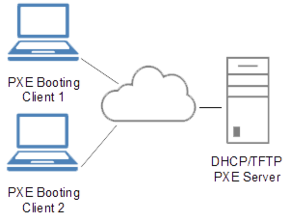
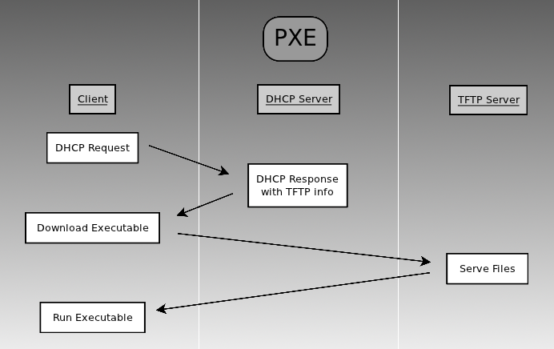
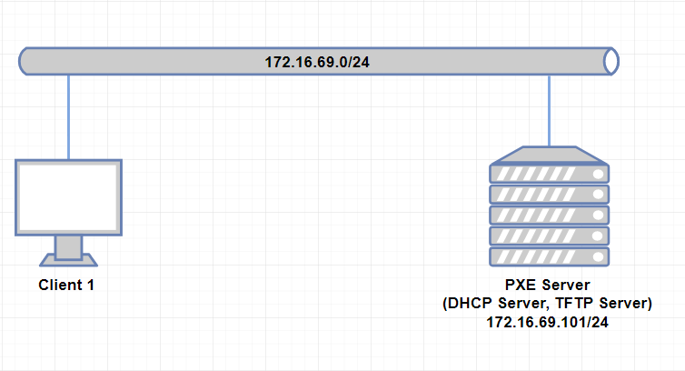
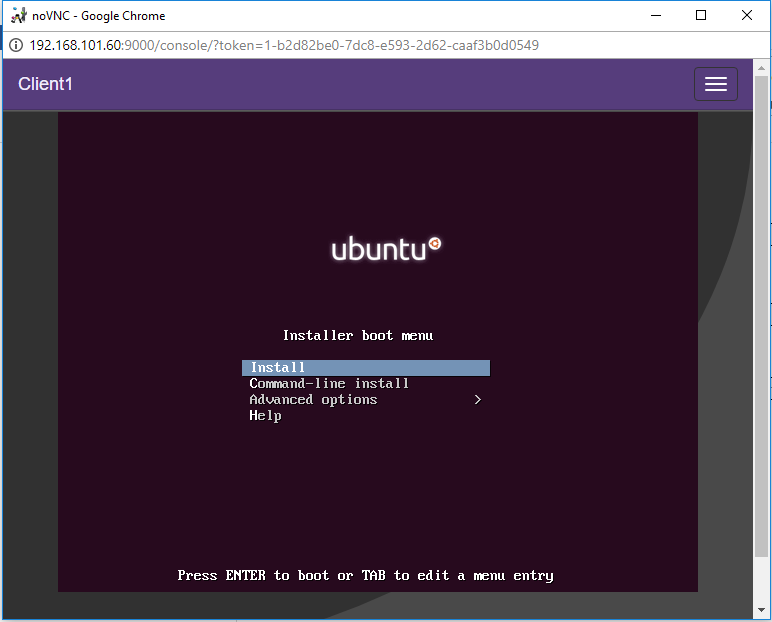

# 1.PXE

# MỤC LỤC
  - [1.1.Giới thiệu PXE](#11giới-thiệu-pxe)
  - [1.2.PXE workflow](#12pxe-workflow)
  - [1.3.LAB PXE](#13lab-pxe)
    - [1.3.1.Mô hình](#131mô-hình)
    - [1.3.2.Cài đặt và cấu hình](#132cài-đặt-và-cấu-hình)
      - [1.3.2.1.Trên PXE Server](#1321trên-pxe-server)
        - [a.Cài đặt và cấu hình DHCP Server](#acài-đặt-và-cấu-hình-dhcp-server)
        - [b.Cài đặt và cấu hình TFTP Server](#bcài-đặt-và-cấu-hình-tftp-server)
        - [c.Cấu hình cài đặt để boot](#ccấu-hình-cài-đặt-để-boot)
        - [d.Cấu hình để PXE client cài Ubuntu Server 16.04 từ repo local](#dcấu-hình-để-pxe-client-cài-ubuntu-server-1604-từ-repo-local)
      - [1.3.2.2.Trên Client 1](#1322trên-client-1)


## 1.1.Giới thiệu PXE
\- PXE (Preboot eXecution Environment) là giao thức đơn giản được phát triển bởi Intel và 1 vài vendors khác. PXE có nguồn gốc từ DHCP, và thường được thực hiện trong NIC.  
\- PXE miêu tả môi trường client-server để boot phần mềm được lấy từ mạng trên client có hỗ trợ PXE. Trên phía client, yêu cầu NIC có hỗ trợ PXE, và sử dụng 1 bộ giao thức mạng tiêu chuẩn bao gồm DHCP và TFTP (TFTP là giao thức truyền files, thực thi trên giao thức UDP/IP sử dụng port 69).  
\- PXE thường được sử dụng để booting OS, cài đặt và triển khai.  



## 1.2.PXE workflow


\- Bước 1: Hệ thống BIOS boot up và xác định thứ tự boot.  
\- Bước 2: Nếu thứ tự boot đặt PXE trước hard disk, hoặc flash drives, hoặc CD-ROM, hoặc nếu không có thiết bị nào trong số đó, Universal Network Driver Interface (UNDI) sẽ được load từ NIC. NIC có driver điều khiển thiết bị mạng nhỏ và thực thi TFTP.  
\- Bước 3: Hệ thống bắt đầu thực hiện chương trình UDP broadcast đơn giản, tìm kiếm DCHP server. Đây thực sự là bước đầu tiên của PXE boot và gọi là Discover.  
\- Bước 4: DHCP server nghe được broadcast, nó sẽ đáp ứng với 1 IP address. Bước này gọi là Offer. Điểm quan trọng cần lưu ở đây, PXE là stateless và số lượng thông tin hệ thống mà client cung cấp tại thời điểm này khá hạn chế (địa chỉ MAC và System Management BIOS GUID).  
\- Bước 5: Client sau khi nhận packet với địa chỉ IP, sau đó nó nói nó thực sự cần thêm thông tin - cụ thể là địa chỉ PXE server. Một broadcast khác xảy ra, bao gồm thông tin từ DHCP server trả lời. Client gọi DHCP server, “Tôi cần thêm thông tin – cụ thể, tôi cần vị trí Network Boot Program (NBP)”. Bước này gọi là Request.  
\- Bước 6: PXE server trả lời địa chỉ của PXE server và vị trí của NBP server, 1 thực thị boot nhỏ mà yêu cầu nhỏ hơn 32KB. Bước này gọi là Acknowledge.  
\- Bước 7: Client download NBP từ vị trí mạng được chỉ định bởi PXE server. TFTP được chọn vì tính bảo mật hoặc hiệu năng của nó – theo mặc định, quản trị viên router sẽ disable nó. Nó phải được kích hoạt cho PXE để hoạt động.  
\- Bước 8: NBP được khởi tạo.  

## 1.3.LAB PXE
### 1.3.1.Mô hình


\- PXE Server:  
- Cài hệ điều hành Ubuntu Server 16.04.
- Cài đặt `isc-dhcp-server` làm DHCP server, `tftpd-hpa` làm TFTP server. Cài đặt PXE Serer làm server boot OS Ubuntu Server 16.04.
- PXE Server có 1 card mạng ens3 có địa chỉ IP 172.16.69.101.

\- Client 1: Boot qua mạng OS Ubuntu Server 16.04.  

### 1.3.2.Cài đặt và cấu hình
#### 1.3.2.1.Trên PXE Server
##### a.Cài đặt và cấu hình DHCP Server
\- Cài phần mềm isc-dhcp-server làm DHCP server:  
```
# apt install isc-dhcp-server
```

\- Sửa hoặc tạo ( nếu không có ) 1 file `/etc/default/isc-dhcp-server` với quyền root có nội dung như sau :  
```
INTERFACES="ens3"
```

\- Cấu hình 2 dải IP cấp cho client. Mở và cấu hình file:  
```
sudo vi /etc/dhcp/dhcpd.conf
```

và ghi nội dung như sau :  
```
ddns-update-style none;
default-lease-time 600;
max-lease-time 7200;
authoritative;

subnet 172.16.69.0 netmask 255.255.255.0 {
range 172.16.69.50 172.16.69.100;
range 172.16.69.150 172.16.69.200;
option domain-name-servers 172.16.69.1;
option domain-name "network_one";
option routers 172.16.69.1;
option broadcast-address 172.16.69.255;
}
```

\- Khởi động lại dịch vụ `isc-dhcp-server`:  
```
sudo systemctl restart isc-dhcp-server
```

\- Chú ý: tắt các DHCP server khác.  

##### b.Cài đặt và cấu hình TFTP Server
\- Cài các gói phần mềm:  
```
# apt-get install tftpd-hpa inetutils-inetd
```

\- Sửa file `/etc/default/tftpd-hpa` :  
```
TFTP_USERNAME="tftp"
RUN_DAEMON="yes"
TFTP_DIRECTORY="/var/lib/tftpboot"
TFTP_ADDRESS=":69"
TFTP_OPTIONS="--secure"
```

\- Sửa file `/etc/inetd.conf` :  
```
[...]
tftp    dgram   udp    wait    root    /usr/sbin/in.tftpd /usr/sbin/in.tftpd -s /var/lib/tftpboot
```

\- Khởi động lại dịch vụ `tftpd-hpa`:  
```
# systemctl restart tftpd-hpa
```

\- Cấu hình DHCP Server tương thích  với TFTP Server  
Sửa cấu hình dhcp bằng cách sửa file `/etc/dhcp/dhcpd.conf` :  
```
[...]
allow booting;
allow bootp;
option option-128 code 128 = string;
option option-129 code 129 = text;
next-server 172.16.69.101;
filename "pxelinux.0";
```

\- Khởi động lại dịch vụ `isc-dhcp-server`:  
```
# systemctl restart isc-dhcp-server
```

##### c.Cấu hình cài đặt để boot
\- Download file `.iso` Ubuntu Server 16.04, sử dụng câu lệnh sau:  
```
wget http://mirrors.nhanhoa.com/ubuntu-releases/16.04.3/ubuntu-16.04.3-server-amd64.iso
```

\- Thực hiện mount:  
```
mount -o loop ubuntu-16.04.3-server-amd64.iso /mnt
```

\- Copy các file yêu cầu từ ISO image đến thư mục `/var/lib/tftpboot/` :  
```
cp -r /mnt/install/netboot/* /var/lib/tftpboot/
```

\- Chú ý :  
Ngoài cách trên, bạn cũng có thể download thư mục netboot cho ubuntu server 16.04:  
```
wget --recursive --no-parent http://archive.ubuntu.com/ubuntu/dists/xenial/main/installer-amd64/current/images/netboot/
```

##### d.Cấu hình để PXE client cài Ubuntu Server 16.04 từ repo local
\- Cài web server apache2:  
```
sudo apt-get install apache2
```

\- Copy thư mục `/mnt` đến `/var/www/html` và đổi tên thành `ubuntu-16.04` :  
```
cp -r /mnt /var/www/html/ubuntu-16.04
```

#### 1.3.2.2.Trên Client 1
\- Yêu cầu NIC hỗ trợ boot bằng PXE.  
\- Chọn boot từ PXE.  



