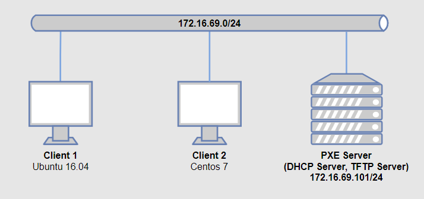
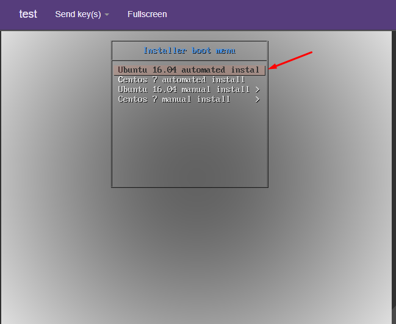

# 3.Preseed

# MỤC LỤC
  - [3.1.Giới thiệu](#31giới-thiệu)
    - [3.1.1.Preseeding methods](#311preseeding-methods)
    - [3.1.2.Cơ bản về debconf](#312cơ-bản-về-debconf)
  - [3.2.Using preseeding](#32using-preseeding)
    - [3.2.1.Tải file preconfiguration](#321tải-file-preconfiguration)
    - [3.2.2.Sử dụng boot parameters để tự động trả lời câu hỏi](#322sử-dụng-boot-parameters-để-tự-động-trả-lời-câu-hỏi)
    - [3.2.3.Auto mode](#323auto-mode)
    - [3.2.4.Aliases dùng với preseeding](#324aliases-dùng-với-preseeding)
  - [3.3.Tạo file preconfiguration](#33tạo-file-preconfiguration)
  - [3.4.Hướng dẫn viết file preseed](#34hướng-dẫn-viết-file-preseed)
  - [3.5.LAB PXE sử dụng Preseed và Kickstart](#35lab-pxe-sử-dụng-preseed-và-kickstart)
    - [3.5.1.Mô hình](#351mô-hình)
    - [3.5.2.Cài đặt và cấu hình](#352cài-đặt-và-cấu-hình)
      - [3.5.2.1.Trên PXE Server](#3521trên-pxe-server)
        - [a.Cài đặt và cấu hình DHCP Server](#acài-đặt-và-cấu-hình-dhcp-server)
        - [b.Cài đặt và cấu hình TFTP Server](#bcài-đặt-và-cấu-hình-tftp-server)
        - [c.Cấu hình prelinux](#ccấu-hình-prelinux)
        - [d.Cấu hình netboot image](#dcấu-hình-netboot-image)
        - [e.Cấu hình để PXE client cài Ubuntu Server 16.04 và Centos 7 từ repo local](#ecấu-hình-để-pxe-client-cài-ubuntu-server-1604-và-centos-7-từ-repo-local)
        - [f.File preseed và kickstart](#ffile-preseed-và-kickstart)
      - [3.5.2.2.Trên Client 1](#3522trên-client-1)
      - [3.5.2.3.Trên Client 2](#3523trên-client-2)


## 3.1.Giới thiệu
\- Preseeding cung cấp phương phát để thiết lập câu trả lời cho những câu hỏi trong quá trình cài đặt, mà không phải nhập thủ công câu trả lời. Điều này làm cho nó có thể hoàn toàn tự động hầu hết các loại cài đặt và thậm chí cung cấp 1 số tính năng không có sẵn trong quá trình cài đặt.  
\- Preseeding không bắt buộc phải có. Nếu bạn sử dụng file preseed trống, quá trình cài đặt sẽ giống như cài đặt thủ công bình thường.  

### 3.1.1.Preseeding methods
\- Có 3 methods được sử dụng cho preseeding: **initrd**, **file** và **network**.  
\- Initrd preseeding sẽ làm việc với bất kỳ phương thức cài đặt nào và hỗ trợ preseeding nhiều thứ hơn, nhưng yêu cầu chuẩn bị nhiều thứ nhất. File và network preseeding có thể được sử dụng với nhiều phương thức cài đặt khác nhau.  
\- Bảng sau đây show ra preseeding methods có thể được sử dụng với phương thức cài đặt nào:  


### 3.1.2.Cơ bản về debconf
\\- Preseeding sử dụng debconf framework. Framework này là cơ chế ưa thích được sử dụng trong Ubuntu để tương tác với người dùng khi cấu hình packages và cũng là trái tim của debian-installer. Trong debconf framework, câu hỏi hoặc hộp thoại dựa trên templates. Có nhiều loại templates khác nhau cho những loại câu hỏi khác nhau.  
\- Các loại templates sau đây liên quan đến preseeding.  
- string: allows the user to type any value
- password: similar to string but the value typed is not displayed
- boolean: for yes/no or true/false type of questions
- select: allows the user to select one option from a list
- multiselect: allows the user to select zero, one or more options from a list
- note: used to display a message

## 3.2.Using preseeding
### 3.2.1.Tải file preconfiguration
\- Bạn có thể chỉ định file preconfiguration trong file cấu hình boot loader.  
\- Ví dụ:  
```
Boot parameters to specify:
- if you're netbooting:
  preseed/url=http://host/path/to/preseed.cfg
  preseed/url/checksum=5da499872becccfeda2c4872f9171c3d
- or
  preseed/url=tftp://host/path/to/preseed.cfg
  preseed/url/checksum=5da499872becccfeda2c4872f9171c3d

- if you're booting a remastered CD:
  preseed/file=/cdrom/preseed.cfg
  preseed/file/checksum=5da499872becccfeda2c4872f9171c3d

- if you're installing from USB media (put the preconfiguration file in the
  toplevel directory of the USB stick):
  preseed/file=/hd-media/preseed.cfg
  preseed/file/checksum=5da499872becccfeda2c4872f9171c3d
```

> Chú ý:  
 preseed/url có thể viết tắt là url, preseed/file có thể viết tắt là file và preseed/file/checksum có thể viết là preseed-md5.

### 3.2.2.Sử dụng boot parameters để tự động trả lời câu hỏi
\- Nếu file preconfiguration không được sử dụng để tự động trả lời cho tất cả các bước cài đặt, cài đặt vẫn có thể tự động hoàn thành tất cả, bạn có thể thông qua giá trị có preseed trong file cấu hình bootlooader.  
\- Để thiết lập giá trị được sử dụng trong debian-installer, ta thêm `path/to/variable=value` cho bất kỳ biến pressed nào.  
\- Tham khảo thêm:  
https://help.ubuntu.com/lts/installation-guide/armhf/apbs02.html#ftn.idm45569767151584

### 3.2.3.Auto mode
\- Tham khảo:  
https://help.ubuntu.com/lts/installation-guide/armhf/apbs02.html#ftn.idm45569767151584 

### 3.2.4.Aliases dùng với preseeding
\- Aliases có thể được sử dụng cho preseeding (auto mode).  
VD: auto=true và interface=eth0.  

|||
|---|---|
|priority|debconf/priority|
|fb|debian-installer/framebuffer|
|language|debian-installer/language|
|country|debian-installer/country|
|locale|debian-installer/locale|
|theme|debian-installer/theme|
|auto|auto-install/enable|
|classes|auto-install/classes|
|file|preseed/file|
|url|preseed/url|
|domain|netcfg/get_domain|
|hostname|netcfg/get_hostname|
|interface|netcfg/choose_interface|
|protocol|mirror/protocol|
|suite|mirror/suite|
|modules|anna/choose_modules|
|recommends|base-installer/install-recommends|
|tasks|tasksel:tasksel/first|
|desktop|tasksel:tasksel/desktop|
|dmraid|disk-detect/dmraid/enable|
|keymap|keyboard-configuration/xkb-keymap|
|preseed-md5|preseed/file/checksum|

## 3.3.Tạo file preconfiguration
\- File preconfiguration có định dạng được sửu dụng bởi câu lệnh debconf-set-selectioms. Định dạng chung của 1 dòng trong file preconfiguration:  
```
<owner> <question name> <question type> <value>
```

\- Có 1 vài quy tắc để viết file preconfiguraiton:  
- Chỉ có 1 space hoặc tab giữa type và vaule: bất kỳ whitespace được thêm sẽ thuộc về giá trị.
- 1 dòng có thể chai thành nhiều dòng được nối với nhau bằng dấu gạch backslash (\).
- Đối với biến debconf (templates) chỉ được sử dụng trong quá trình cài đặt, ower nên thiết lập là “d-i”.
- Hầu hết các câu hỏi cần phải đươc trả lời sử dụng giá trị bằng tiếng Anh và không được dịch. Tuy nhiên có 1 số câu hỏi (VD: partman) trong đó cần phải sử dụng các giá trị dịch.
- Một số câu hỏi lấy code làm giá trị thay vì văn bản tiếng Anh được hiển thị trong quá trình cài đặt.  

\- Bạn có thể tự viết file preconfiguration hoặc thực hiện cài đặt thủ công và sau đó sử dụng debconf-det-delections từ package debconf-utils để dump cả cơ sở dữ liệu và debconf và cơ dỡ dữ liệu cdebconf của quá trình cài đặt thành 1 file duy nhất:  
```
$ debconf-get-selections --installer > file
$ debconf-get-selections >> file
```

## 3.4.Hướng dẫn viết file preseed
\- Tham khảo:  
https://help.ubuntu.com/lts/installation-guide/armhf/apbs04.html  
https://help.ubuntu.com/lts/installation-guide/armhf/apbs05.html  
https://help.ubuntu.com/lts/installation-guide/example-preseed.txt  

\- 1 số chú ý với file preseed cho Ubuntu 16.04:  
- Khi cài OS có 2 disk, phải chỉ rõ là cài OS trên disk nào!

## 3.5.LAB PXE sử dụng Preseed và Kickstart
### 3.5.1.Mô hình



\- PXE Server:  
- Cài hệ điều hành Ubuntu Server 16.04.
- Cài đặt `isc-dhcp-server` làm DHCP server, `tftpd-hpa` làm TFTP server. Cài đặt PXE Serer làm server boot OS Ubuntu Server 16.04.
- PXE Server có 1 card mạng ens3 có địa chỉ IP 172.16.69.101.

\- Client 1: Boot qua mạng OS Ubuntu Server 16.04.  
\- Client 2: Boot qua mạng OS Centos 7.  

### 3.5.2.Cài đặt và cấu hình
#### 3.5.2.1.Trên PXE Server
##### a.Cài đặt và cấu hình DHCP Server
\- Cài phần mềm isc-dhcp-server làm DHCP server:  
```
# apt install isc-dhcp-server
```

\- Sửa hoặc tạo ( nếu không có ) 1 file `/etc/default/isc-dhcp-server` với quyền root có nội dung như sau :  
```
INTERFACES="ens3"
```

\- Cấu hình 2 dải IP cấp cho client. Mở và cấu hình file:  
```
sudo vi /etc/dhcp/dhcpd.conf
```

và ghi nội dung như sau :  
```
ddns-update-style none;
default-lease-time 600;
max-lease-time 7200;
authoritative;

subnet 172.16.69.0 netmask 255.255.255.0 {
range 172.16.69.50 172.16.69.100;
range 172.16.69.150 172.16.69.200;
option domain-name-servers 172.16.69.1;
option domain-name "network_one";
option routers 172.16.69.1;
option broadcast-address 172.16.69.255;
}
```

\- Khởi động lại dịch vụ `isc-dhcp-server`:  
```
sudo systemctl restart isc-dhcp-server
```

\- Chú ý: tắt các DHCP server khác.  

##### b.Cài đặt và cấu hình TFTP Server
\- Cài các gói phần mềm:  
```
# apt-get install tftpd-hpa inetutils-inetd
```

\- Sửa file `/etc/default/tftpd-hpa` :  
```
TFTP_USERNAME="tftp"
RUN_DAEMON="yes"
TFTP_DIRECTORY="/var/lib/tftpboot"
TFTP_ADDRESS=":69"
TFTP_OPTIONS="--secure"
```

\- Sửa file `/etc/inetd.conf` :  
```
[...]
tftp    dgram   udp    wait    root    /usr/sbin/in.tftpd /usr/sbin/in.tftpd -s /var/lib/tftpboot
```

\- Khởi động lại dịch vụ `tftpd-hpa`:  
```
# systemctl restart tftpd-hpa
```

\- Cấu hình DHCP Server tương thích  với TFTP Server  
Sửa cấu hình dhcp bằng cách sửa file `/etc/dhcp/dhcpd.conf` :  
```
[...]
allow booting;
allow bootp;
option option-128 code 128 = string;
option option-129 code 129 = text;
next-server 172.16.69.101;
filename "pxelinux.0";
```

\- Khởi động lại dịch vụ `isc-dhcp-server`:
```
# systemctl restart isc-dhcp-server
```

##### c.Cấu hình prelinux
> Chú ý : Thực hiện đúng như sau, không nên tự ý thay đổi cách khác.

\- Download file `.iso` Ubuntu Server 16.04, sử dụng câu lệnh sau:  
```
wget http://mirrors.nhanhoa.com/ubuntu-releases/16.04.3/ubuntu-16.04.3-server-amd64.iso
```

\- Thực hiện mount:  
```
# mount -o loop ubuntu-16.04.3-server-amd64.iso /mnt
```

\- Copy netboot image đến thư mục `/var/lib/tftpboo`t :  
```
# cp -r /mnt/install/netboot/ubuntu-installer/ /var/lib/tftpboot/
```

\- Thực hiện các command sau:  
```
# cd /var/lib/tftpboot/ubuntu-installer/amd64
mv pxelinux.0 ../..
mv pxelinux.cfg/ ../..
mv boot-screens/ ../..
cd ../..
mv boot-screens/ldlinux.c32 .
chmod 644 boot-screens/*
rm -rf ubuntu-installer/
```

\- Sửa nội dung file `boot-screens/syslinux.cfg`:  
```
# D-I config version 2.0
# search path for the c32 support libraries (libcom32, libutil etc.)
path boot-screens/
include boot-screens/menu.cfg
default boot-screens/vesamenu.c32
prompt 0
timeout 0
```

\- Sửa nội dung file `boot-screens/menu.cfg` :  
```
menu hshift 13
menu width 49
menu margin 8
menu tabmsg

menu title Installer boot menu
label auto-ubuntu-16.04
        menu label ^Ubuntu 16.04 automated install
        kernel ubuntu-installer/amd64/linux
        append auto url=http://172.16.69.101/ubuntu-preseed.cfg vga=normal initrd=ubuntu-installer/amd64/initrd.gz locale=en_US keyboard-configuration/layoutcode=us hostname=ubuntu interface=eth0 biosdevname=0 net.ifnames=0
label auto-centos-7
        menu label ^Centos 7 automated install
        kernel centos-installer/vmlinuz
        append ks=http://172.16.69.101/kscentos.cfg vga=normal initrd=centos-installer/initrd.img

menu begin ubuntu-16.04
        menu title Ubuntu 16.04 manual install
        label mainmenu
                menu label ^Back..
                menu exit
        include ubuntu-installer/amd64/boot-screens/menu.cfg
menu end
menu begin centos-7
        menu title Centos 7 manual install
        label mainmenu
                menu label ^Back..
                menu exit
        include centos-installer/default
menu end
```

##### d.Cấu hình netboot image
\- Như phần trên đã download Ubuntu 16.04 và mount vào thư mục /mnt. Giờ ta copy netboot image đến thư mục `/var/lib/tftpboot` :  
```
# cp -r /mnt/install/netboot/ubuntu-installer/ /var/lib/tftpboot/
```

Sau đó ta umount /mnt:  
```
# umount /mnt
```

\- Download Centos 7:  
```
wget http://centos-hn.viettelidc.com.vn/7/isos/x86_64/CentOS-7-x86_64-Minimal-1708.iso
```

\- Thực hiện mount:  
```
# mount -o loop CentOS-7-x86_64-Minimal-1708.iso /mnt
```

\- Copy netboot image đến thư mục `/var/lib/tftpboot` :  
```
# cp -r /mnt/images/preboot/ /var/lib/tftpboot/
# mv /var/lib/tftpboot/preboot/ /var/lib/tftpboot/centos-install
```

\- Trong thư mục `centos-install`, tạo file `default` với nội dung như sau:  
```
menu title Centos 7 manual install
label 1
        menu label ^1) Install CentOS 7
        kernel centos-installer/vmlinuz
        append initrd=centos-installer/initrd.img method=http://172.16.69.101/centos7
```

##### e.Cấu hình để PXE client cài Ubuntu Server 16.04 và Centos 7 từ repo local
\- Cài web server apache2:  
```
sudo apt-get install apache2
```

\- Ở trên đã mount `CentOS-7-x86_64-Minimal-1708.iso` vào thư mục `/mnt` . Giờ ta copy:  
```
# cp -r /mnt /var/www/html/centos7/
```

Sau đó ta umount /mnt:  
```
# umount /mnt
```

\- Thực hiện mount:  
```
# mount -o loop ubuntu-16.04.3-server-amd64.iso /mnt
```

\- Copy thư mục `/mnt` đến `/var/www/html` và đổi tên thành `ubuntu-16.04` :  
```
cp -r /mnt /var/www/html/ubuntu-16.04
```

##### f.File preseed và kickstart
\- File preseed cho Ubuntu 16.04:  
Tạo file `/var/www/html/ubuntu-preseed.cfg` với nội dung như sau:  
```
#### Contents of the preconfiguration file (for xenial)

### Localization
# Preseeding only locale sets language, country and locale.
#d-i debian-installer/locale string en_US

# Keyboard selection
#d-i console-setup/ask_detect boolean false
#d-i keyboard-configuration/xkb-keymap select us

### Network configuration
#d-i netcfg/choose_interface select auto
#d-i netcfg/get_hostname string ubuntu

### Mirror settings
d-i mirror/country string manual
d-i mirror/http/hostname string 172.16.69.101
d-i mirror/http/directory string /ubuntu-16.04
d-i mirror/http/proxy string

### Account setup
d-i passwd/root-login boolean true
d-i passwd/make-user boolean true

# Root password, either in clear text
d-i passwd/root-password password welcome123
d-i passwd/root-password-again password welcome123

# To create a normal user account.
d-i passwd/user-fullname string Ubuntu User
d-i passwd/username string ubuntu
d-i passwd/user-password password welcome123
d-i passwd/user-password-again password welcome123
d-i user-setup/allow-password-weak boolean true
d-i user-setup/encrypt-home boolean false

# Set to true if you want to encrypt the first user's home directory.
d-i user-setup/encrypt-home boolean false

### Clock and time zone setup
d-i clock-setup/utc boolean true
d-i time/zone string Asia/Ho_Chi_Minh

d-i clock-setup/ntp boolean true
d-i clock-setup/ntp-server string ntp.ubuntu.com

### Partitioning
d-i partman-auto/method string regular
d-i partman-auto/disk string /dev/[svh]da
d-i partman-lvm/device_remove_lvm boolean true
d-i partman-md/device_remove_md boolean true
d-i partman-auto/choose_recipe select atomic
d-i partman-partitioning/confirm_write_new_label boolean true
d-i partman/choose_partition select finish
d-i partman/confirm boolean true
d-i partman/confirm_nooverwrite boolean true

### Package selection
tasksel tasksel/first multiselect openssh-server
d-i pkgsel/upgrade select none
d-i pkgsel/update-policy select none

### Boot loader installation
d-i grub-installer/only_debian boolean true

# To install to the first device (assuming it is not a USB stick):
d-i grub-installer/bootdev string default

# Verbose output and no boot splash screen.
d-i	debian-installer/quiet	boolean false
d-i	debian-installer/splash	boolean false
d-i debian-installer/add-kernel-opts string biosdevname=0 net.ifnames=0

### Finishing up the installation
# Avoid that last message about the install being complete.
d-i finish-install/reboot_in_progress note

### Post Installer
d-i preseed/late_command string \
# Config ssh
sed -i 's/PermitRootLogin prohibit-password/PermitRootLogin yes/g' /target/etc/ssh/sshd_config; \
#Config repo
sed -i 's|172.16.69.101/ubuntu-16.04|vn.archive.ubuntu.com/ubuntu|g' /target/etc/apt/sources.list; \
apt-get update -y && apt-get upgrade -y; \
cd /target/root; \
mkdir test
```

\- File kickstart cho Centos 7:  
Tạo file `/var/www/html/kscentos.cfg` với nội dung như sau:  
```
#Generic Kickstart template for Centos 7
#Platform: x86 and x86-64

#System language
lang en_US

#System keyboard
keyboard us

#System timezone
timezone Asia/Ho_Chi_Minh

#Root password
rootpw son123456

# Creates a new user on the system
user centos --name=centos --password=son123456

#System authorization infomation
auth  --useshadow  --enablemd5 

#System bootloader configuration
bootloader --location=mbr
#Partition clearing information
clearpart --all
#Basic disk partition
part / --fstype ext4 --size 5 --grow --asprimary --ondisk=vda
part swap --size 1024 --ondisk=vda
part /boot --fstype ext4 --size 1024 --ondisk=vda

#Use text mode install
text

# Firewall configuration
firewall --enabled
# SELinux configuration
selinux --disabled

#Network information
#network --bootproto=dhcp --device=eth0 --onboot=on

# config repo source.list
url --url http://172.16.69.101/centos7

# Do not configure the X Window System
skipx

#Reboot after installation
reboot

#Install packages
%packages --ignoremissing

%end

#Run command when system installation is complete
%post
yum update -y
cd /root
mkdir test
%end
```

#### 3.5.2.2.Trên Client 1
\- Yêu cầu NIC hỗ trợ boot bằng PXE.  
\- Chọn boot từ PXE.  
\- Cài đặt tự động:  


\- Cài đặt thủ công:  


#### 3.5.2.3.Trên Client 2
\- Yêu cầu NIC hỗ trợ boot bằng PXE.  
\- Chọn boot từ PXE.  
\- Cài đặt tự động:  


\- Cài đặt thủ công:  


